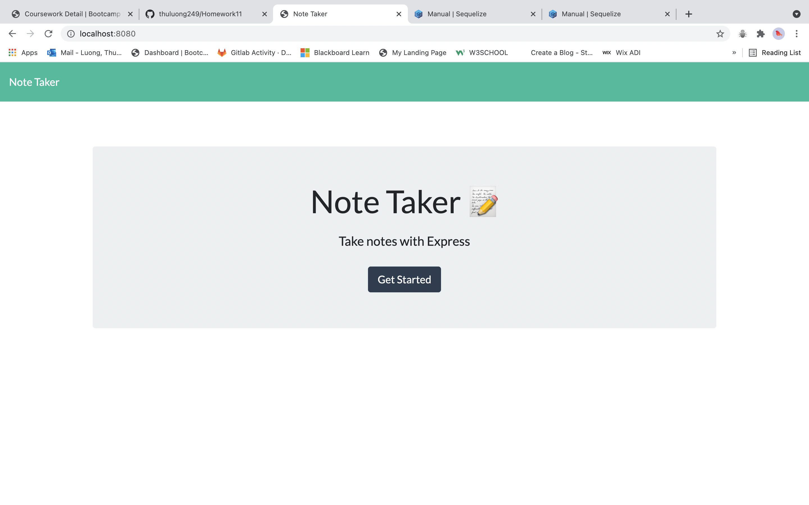

# Thu Luong 

# About Me 👩‍💻
Since I moved to the US from Vietnam two years ago, I held two part-time jobs and in 2021 decided to return to my studies. I completed a bachelor’s degree in Banking and Finance in Vietnam, but as a student now, the most interesting thing is using my second language, English, in class. Upon taking up my studies again, I was nervous despite having previously worked in accounting, but I learned a lot. Overcoming this initial challenge of using my second language in a field I studied before, I decided to undertake a greater challenge and join University of Connecticut’s Certificate in Coding Course. <a href="https://bootcamp.uconn.edu/" rel="nofollow">Full Stack Web Development</a>. It has not been easy, but I am not turning back. I have decided to dedicate my energy to completing the Bootcamp, and I am giving it my best.

# 📝🔖 Skills/Languages 📝🔖

        HTML/CSS
        Bootstrap
        Javascript
        Node Js
        Express
        MySQL

# Projects 💻

## [Note-Taker](https://thuluong249.github.io/homework11-note-taker/)

`Note-Taker is an application that allows user to create notes in the back-end. Then they can view their notes by clicking on them in the list. The user is also able to delete them.`

## [Employee-Tracker](https://thuluong249.github.io/hw12-emplyee-tracker/)

`Employee-tracker is an application that allows user to manage their employees in a content managerment system. The user can also view and manage all the departments, roles and employee.`

# Contact Infomations

* [Github](https://github.com/thuluong249)
* [LinkedIn](https://www.linkedin.com/in/thu-luong-8aa013212/)
* <a href="mailto:thujtn2019@gmmail.com">💌 Email me</a> 

